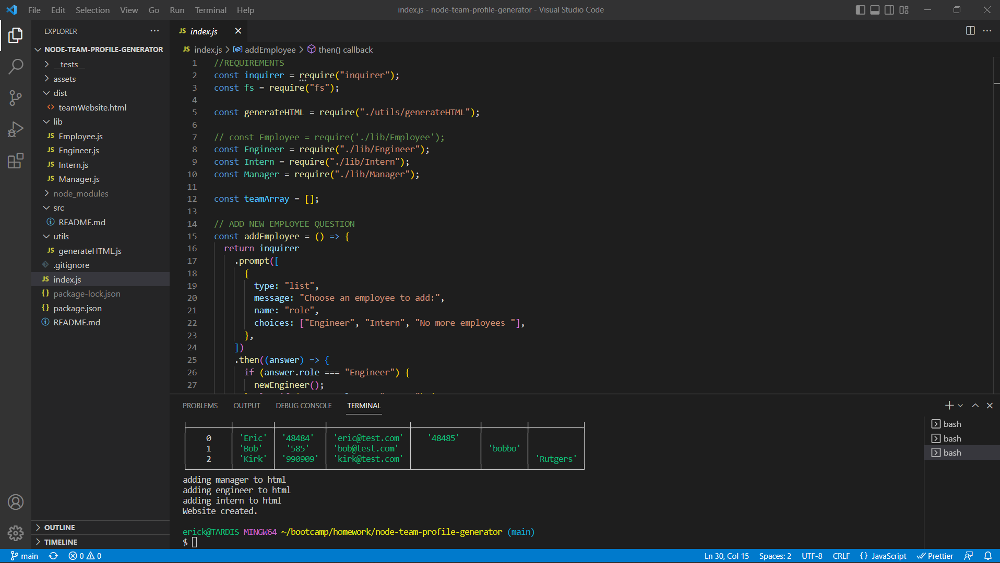

# Node Team Profile Generator

This is my Team Profile Generator.  It is a Node.js command-line application that takes in information about employees on a software engineering team and generates an HTML webpage that displays summaries for each person.  The purpose of this project was to practice my use of node.js, npm installation and usage, callback functions, and how to pass data from one function to another.  Future improvements include at least some base-level of styling on the final html page.  I also played around with methods of condensing the questions into one set, but pivoted off due to time constraints.

## Table of Contents

- [Installation](#installation)
- [Usage](#usage)
- [Credits](#credits)
- [License](#license)

## Installation

This program requires installation of inquirer npm.

## Usage

To use this program, first open index.js in the intergrated terminal.  Then install the npm inquirer v8.2.4.  When this is done, run index in node and answer all the questions when prompted.  After all questions are answered, an HTML file populated with the information given in the prompts will be generated into the dist folder.  

## Credits

N/A

## License

N/A
